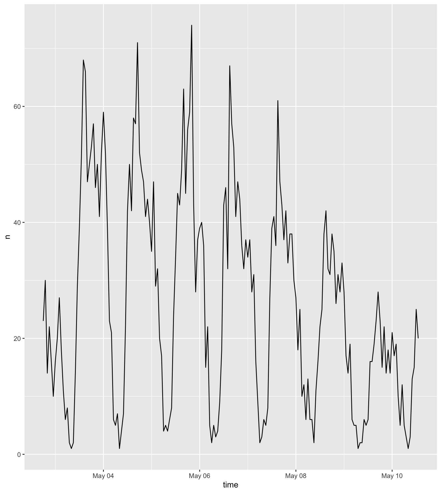
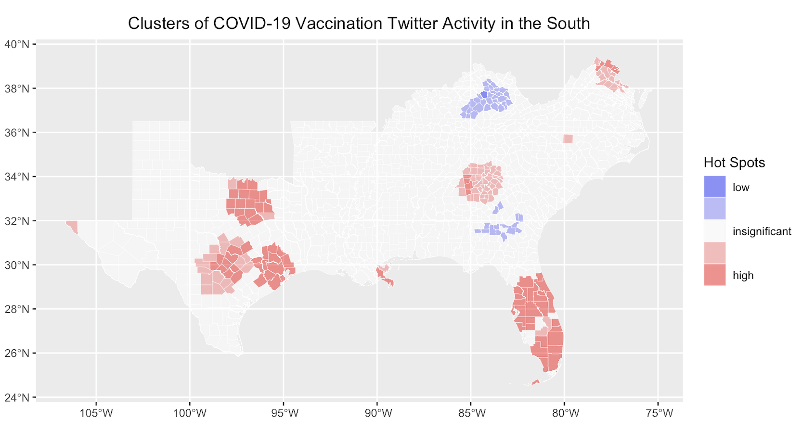

**Replication of**
# Spatial, temporal and content analysis of Twitter data

Original study *by* Wang, Z., X. Ye, and M. H. Tsou. 2016. Spatial, temporal, and content analysis of Twitter for wildfire hazards. *Natural Hazards* 83 (1):523–540. DOI:[10.1007/s11069-016-2329-6](https://doi.org/10.1007/s11069-016-2329-6).
and
First replication study by Holler, J. 2021 (in preparation). Hurricane Dorian vs Sharpie Pen: an empirical test of social amplification of risk on social media.

Replication Author: Drew An-Pham

Replication Materials Available at: [RE-Dorian Repository](https://github.com/daptx/RE-Dorian)

Created: `10 May 2021`
Revised: `12 May 2021`

## Abstract

In a digital economy where data is the new currency of knowledge, crowd-sourced/volunteered geographic information (VGI) such as Twitter data has become a powerful utility for approaching spatial inquiries. As such, studying the spatial distribution of Twitter data has presented the opportunity to investigate the dissemination, temporal, and content patterns for current and past events (i.e. natural disasters, the 2020 election results, the colonial pipeline breach, etc), furthering the pool for geospatial research.

In Wang et al's (2016) analysis of Twitter data for wildfires in California, they found that social media data was a valuable asset for enhancing situational awareness and aiding disaster management during wildfire hazards. In this specific case study, Twitter served as an avenue for relaying evacuation warnings, communicating geographic updates about the wildfires, and sharing wildfire-related information with the general public. On a broader note, despite the limitations and ethical uncertainties of using Twitter data in research (Crawford & Finn, 2014), Wang et al's (2016) findings show the potential Twitter data has to ground and characterize natural hazards across spatial, temporal, and content domains.

More recently, Holler (2021) is studying Twitter data for Hurricane Dorian on the Atlantic coast, finding that in spite of trending news and social media content regarding a false narrative of risk, original Tweets still clustered significantly along the real hurricane track, and only along the hurricane track.

Reproducing and replicating spatial research of crowd-sourced/volunteered geographic information (VGI) continues to be relevant because social media (i.e. Twitter) and other mediums for collecting VGI (i.e. OpenStreetMap) have begun to move towards the forefront of communicating and contextualizing 'critical and defining' events, capitalizing on the informative power of the public. With the changing dynamics of our digital landscape, the stock of VGI is continually in flux/not static—meaning that while the reproduction of spatial research isn't always guaranteed, the replication of spatial research using VGI such as Wang et al (2016) via Twitter search API can help expand geospatial knowledge across different time frames and contexts.

In this replication study, I will analyze the spatial distribution of COVID-19 vaccination Tweets in the South (defined by a 40,000 respondent survey done by [Vox](https://www.vox.com/2016/9/30/12992066/south-analysis)) from May 2nd, 2021 to May 10th, 2021. Given the United State's worst vaccination rates are clustered in the South—with Alabama, Mississippi, & Louisiana lagging behind primarily (Chatlani, 2021)—I am curious as to whether these states will have 'cold spots' of Twitter activity, or if any anti-vaccination sentiments will be detected in these places based on content analysis.

## Original Study Information

Wang et al's (2016) original study sourced data from Twitter search API using a two phase collection process. The first phase compiled Tweets that contained either "fire" or "wildfire," while the second phase extracted wildfire tweets pertaining to specific locations—San Marcos and Bernardo. Temporally, the Tweets used spanned from May 13 2013 to May 22, 2014, indicative of the first wildfire occurrence and the point at which the most destructive wildfires were contained. After Tweets were collected, Wang et al (2016) used the `tm` package in `R 3.1.2` for text mining: a way to identify significant term/term clusters in Tweets. In this process, unnecessary 'noise' such as the URLs and stop words were cleaned out from the raw Tweets, then a k-means clustering method was applied to find term clusters—terms commonly occurred in Tweets together. This first part of Wang et al's (2016) content analysis found that the main topics of wildfire-related Twitter conversations revealed geographic awareness during wildfire events, user concern with wildfire response, and an appreciation for firefighters' frontline work.

Similarly, the `igraph` package in `R` was used to conduct a social network analysis, detecting how users' spread and absorb information based on retweet activity. In the case of the Californian wildfires, this analysis highlighted the prevalence of government and local news media in disseminating reliable information during disasters—indicated by a high indegree of their nodes. As such, these findings also revealed the polarized structure of these retweet networks, where a handful of 'influential' users would serve as the hubs of information exchange, with the remaining Twitter-scape (less influential users) lacking both indegree (getting retweeted) and outdegree (retweeting) of their nodes.

Deviating from content analysis, dual kernel density estimation (KDE) was used to visualize hotspots of the specific wildfire tweets for Bernardo and San Marcos fire, taking to account the impact of population. These deliverables helped identify impact areas, as well as emphasizing the spatial patterns of Tweets across the region. For example, San Diego was large hotspot for Twitter activity, however, wasn't densely populated with tweet clusters related to Bernardo fire and Cocos fire, as it wasn't in close proximity to the wildfires' ignition location. It is not known what GIS software was used to execute this spatial analysis.

Likewise, Holler (2021) loosely replicated the methods of Wang et al (2016) for the case of Hurricane Dorian's landfall on the U.S. mainland during the 2019 Atlantic Hurricane season. Holler modified Wang et al's methods by not searching for retweets for network analysis, focusing instead on original Tweet content with keywords hurricane, Dorian, or sharpiegate (a trending hashtag referring to the storm). Holler modified the methodology for normalizing Tweet data by creating a normalized Tweet difference index and extended the methodology to test for spatial clustering with the local Getis-Ord statistic. The study tested a hypothesis that false narratives of hurricane risk promulgated at the highest levels of the United States government would significantly distort the geographic distribution of Twitter activity related to the hurricane and its impacts, finding that original Twitter data still clustered only in the affected areas of the Atlantic coast in spite of false narratives about risk of a westward track through Alabama.

The replication study by Holler (2021) used R, including the `rtweet`, `rehydratoR`, `igraph`, `sf`, and `spdep` packages for analysis.

## Materials and Procedure

The data collection and analysis for this replication used the same methodology as Holler's (2021) case study, adjusting for parameters pertaining to my focus topic—visualizing the spatial distribution of COVID-19 vaccination Tweets in the South. In order to access the data from Twitter's search API, a [Twitter Developer account](https://developer.twitter.com/en/apply-for-access) is required, which is free. There are premium upgrades that allow one to queue and access more Tweets across a larger time scale, however, for the sake of accessibility, a standard developer account was used.

My Twitter API search was conducted on May 10, 2021, indicative of a time where COVID-19 vaccine availability and vaccination appointments had started to become more readily available, yet the *New York Times'* [Vaccination Map](https://www.nytimes.com/interactive/2020/us/covid-19-vaccine-doses.html) showed a lack of vaccinations throughout southern states compared to the Northeast. I searched for Tweets containing the keywords "vaccine," "appointment," or "vaccination" that were within 1,000 miles of Houston, Texas (29.76,-95.37). As well, baseline data on Twitter activity was procured to calculate a Normalized Tweet Difference Index (NTDI) and act as a comparison point for vaccination Tweets. The R-Studio script used to preprocess data can be found [here](https://github.com/daptx/RE-Dorian/blob/main/procedure/code/01-search_texas_daptx.r), and the collection of Tweet ID numbers can be found here: [vaccination Tweets](https://github.com/daptx/RE-Dorian/blob/main/data/derived/public/texasids.txt), [baseline Tweets](https://github.com/daptx/RE-Dorian/blob/main/data/derived/public/baseline.txt).

After preprocessing, analyses across different dimensions (temporal, network, text/contextual, and spatial) were ran using a [modified R-Studio script](https://github.com/daptx/RE-Dorian/blob/main/procedure/code/02-analyze-texas.daptx.r) based on Holler's (2021) R code in his Dorian analysis. This script produced *figures 1, 2, 3, & 4*. Lastly, a [final R-Studio script](https://github.com/daptx/RE-Dorian/blob/main/procedure/code/04-spatial-clustering.r) was ran to map hotspots of Twitter activity. A spatial join was used to join both vaccination and baseline Tweets to counties, then Getis and Ord's (1995) G-statistic was applied to compare the NDTI—defined by Holler (2021) as NDTI = (south - baseline) / (south + baseline) & coded by [Casey Lilley](https://caseylilley.github.io/finalproj.html) (2019)—to COVID-19 vaccination Tweets across the South using a nearest-neighbor analysis. The final results of this script can be seen in *figure 5*, highlighting counties that had statistically significant hot and cold spots of vaccination Twitter activity.

## Replication Results

*figure 1. Number of vaccination related tweets with geo-data by day during the study period*

*figure 2. Most common words found in COVID-19 vaccination tweets by frequency of occurrence*

NOTE: "COVID" & "19" weren't made stop words, since I wanted to see if this phrase was found with vaccination, vaccine, and appointment in Tweets*

*figure 3. Word cloud network, revealing word pairs commonly found within vaccination related Tweets*

*figure 4. Location of vaccination Twitter activity in the South*

*figure 5. Location of hot & cold spots of vaccination Twitter activity in the South by county*

## Unplanned Deviations from the Protocol

In order to visualize vaccination related Twitter activity in the South, R code was implemented to bound/inner-join vaccination Tweet points to the counties of southern states only, rather than the entire US. This deviation also removed Tweets on the outer edge of the 1000mi search radius that could distort the scale of my analysis. Otherwise, no significant deviations were made from the protocol established by Holler (2021).

## Discussion

Provide a summary and interpretation of your key findings in relation to your research question. Mention if findings confirm or contradict patterns observed by Wang et al (2016) or by Holler (2

## Conclusion

Restate the key findings and discuss their broader societal implications or contributions to theory.
Do the research findings suggest a need for any future research?

## References

https://www.npr.org/2021/05/12/996079225/vaccination-rates-lag-in-3-gulf-states-alabama-mississippi-louisiana

Include any referenced studies or materials in the [AAG Style of author-date referencing](https://www.tandf.co.uk//journals/authors/style/reference/tf_USChicagoB.pdf).

####  Report Template References & License

This template was developed by Peter Kedron and Joseph Holler with funding support from HEGS-2049837. This template is an adaptation of the ReScience Article Template Developed by N.P Rougier, released under a GPL version 3 license and available here: https://github.com/ReScience/template. Copyright © Nicolas Rougier and coauthors. It also draws inspiration from the pre-registration protocol of the Open Science Framework and the replication studies of Camerer et al. (2016, 2018). See https://osf.io/pfdyw/ and https://osf.io/bzm54/

Camerer, C. F., A. Dreber, E. Forsell, T.-H. Ho, J. Huber, M. Johannesson, M. Kirchler, J. Almenberg, A. Altmejd, T. Chan, E. Heikensten, F. Holzmeister, T. Imai, S. Isaksson, G. Nave, T. Pfeiffer, M. Razen, and H. Wu. 2016. Evaluating replicability of laboratory experiments in economics. Science 351 (6280):1433–1436. https://www.sciencemag.org/lookup/doi/10.1126/science.aaf0918.

Camerer, C. F., A. Dreber, F. Holzmeister, T.-H. Ho, J. Huber, M. Johannesson, M. Kirchler, G. Nave, B. A. Nosek, T. Pfeiffer, A. Altmejd, N. Buttrick, T. Chan, Y. Chen, E. Forsell, A. Gampa, E. Heikensten, L. Hummer, T. Imai, S. Isaksson, D. Manfredi, J. Rose, E.-J. Wagenmakers, and H. Wu. 2018. Evaluating the replicability of social science experiments in Nature and Science between 2010 and 2015. Nature Human Behaviour 2 (9):637–644. http://www.nature.com/articles/s41562-018-0399-z.
