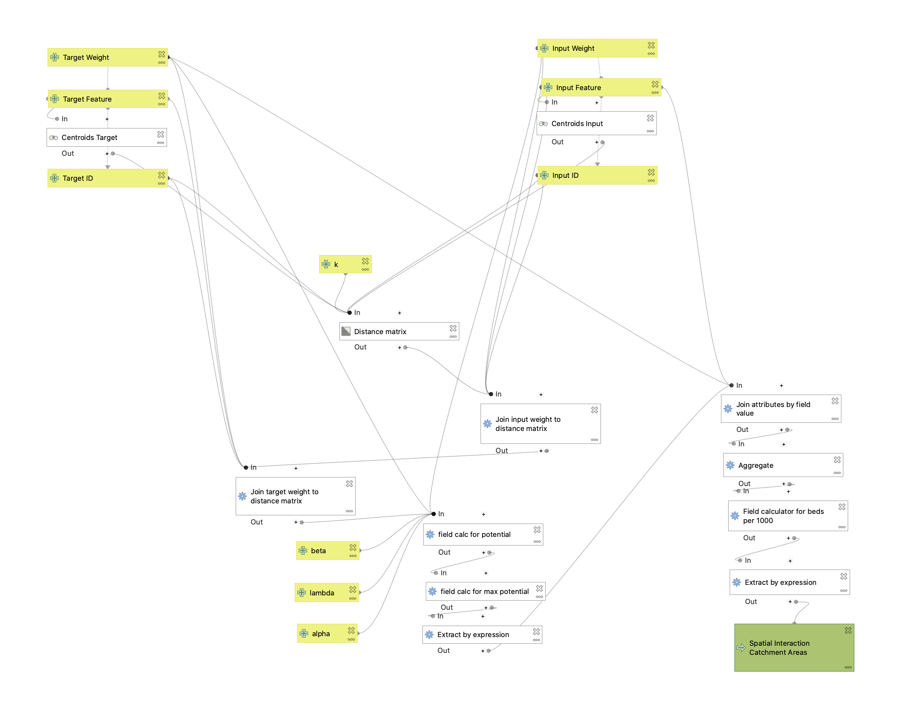

**FINAL DELIVERABLES**
* [Online Map](assets/index.html) of Hospital Catchment across New England
* Workflows:
  * Gravity Model [Image](assets/gravitymodel.png)
  * Gravity Model [.model3 File](assets/gravitymodel.model3)
  * Preprocessing Hospital & NE Towns Data (scroll to: **APPLYING THE MODEL**)

**OVERVIEW**

The Gravity Model of Spatial Interaction created this week takes a set of input and target features, and produces catchments that predict the potential for interaction between the two places. More specifically, our case study applied the gravity model in the context of healthcare. Based on [Homeland Security hospital data](https://hifld-geoplatform.opendata.arcgis.com/datasets/6ac5e325468c4cb9b905f1728d6fbf0f_0) and [New England town data](assets/netown.gpkg) from the American Community Survey 2018 (& processed using [Tidy Census](https://walker-data.com/tidycensus/) in R, thanks Joe <3), we looked at the interactions between hospital clusters and New England towns, then compared the results to preexisting [hospital service area boundaries](https://atlasdata.dartmouth.edu/downloads/supplemental#boundaries) (HSA) from the Dartmouth Atlas of Health Care.

**DECONSTRUCTING THE MODEL**

*right click: open image in new tab for a clearer graphic*

While the [tutorial videos](https://midd.hosted.panopto.com/Panopto/Pages/Sessions/List.aspx#folderID=%22324cb720-6901-48e2-b57a-acdf014ab826%22) for the week provided a good base for setting up the model, it's worth verbalizing how we integrated this workflow (see below) from GEOG 0120 into our final product. 

The gravity model was broken down into 3 main parts:
* Executing a Distance Matrix - This required an input and target feature (both with IDs and weights) and k (the # of nearest features each input was compared to, with a default value of 20). An additional step taken to remove error was converting both input and target features into centroids, as the distance matrix can only utilize points.
* Calculating Max Potential - This first required two joins, where the input weight (population in this case) and target weight (# of beds in this case) were added to the distance matrix. After, a series of field calculators were used to find the potential and and max potential:
> @InputWeight + '^' + to_string(@lambda) + ' * ' + @TargetWeight + '^' + to_string(@alpha) + ' / ("Distance"/1000)' + '^' + to_string(@beta)
> maximum("potential", group_by:= "InputID")

  * *NOTE: By adding exponents to the input weight (λ), target weight (α), and distance parameter (β), we're able to modify the 'significance' of these factors as expressed in Rodrigue’s [The Geography of Transport Systems](https://transportgeography.org/contents/methods/spatial-interactions-gravity-model/)*
* Aggregating the Data to make Catchment Areas - Once all the field calculations were implemented into the distance matrix (via extract by expression), the distance matrix was joined with the the Input Feature, then aggregated by the Target ID. As an extra step, I performed one more field calculator to estimate the # of beds for every 1000 people in each catchment area—the final export.
  * When using extract by expression on the distance matrix, "max potential >0" was used to eliminate any points with Input Weights of 0. Similarly, "SumInputWeight" > 0" was used after the final field calculator to eliminate any edge case with a distance of 0. Both of these edits tackle the gravity model challenges on the [Gravity Model in QGIS](https://gis4dev.github.io/lessons/02a_gravitymodel.html) course page.

**APPLYING THE MODEL**

In order to apply the model to the larger data sets, we first had to preprocess [Homeland Security hospital data](https://hifld-geoplatform.opendata.arcgis.com/datasets/6ac5e325468c4cb9b905f1728d6fbf0f_0) and [New England town data](assets/netown.gpkg).

With [Hosptial.shp](assets/Hospitals.shp):
* *NOTE* this layer was added via **Add ArcGIS Feature Service Layer** with this [link](https://services1.arcgis.com/Hp6G80Pky0om7QvQ/arcgis/rest/services/Hospitals_1/FeatureServer/)
* **tool:** extract by expression --> *save as:* hospitals_filtered.shp
  * **expression:** "BEDS" > 0 AND "TYPE" = 'GENERAL ACUTE CARE' AND "STATUS" = 'OPEN' OR "BEDS" > 0 AND "TYPE" = 'CHILDREN' AND "STATUS" = 'OPEN' OR "BEDS" > 0 AND "TYPE" = 'WOMEN' AND "STATUS" = 'OPEN'
* **tool:** extract by location --> *save as:* hospitals_NE_filtered.shp
  * **extract from:** hospitals_filtered.shp; **intersects**; **compare to:** netown netowns
  * **to check:** feature count [623]

With [netown.gpkg](assets/netown.gpkg):
* **tool:** extract by expression --> *save as:* towns_NE_filtered.shp
  * **expression:** "popE" > 0 AND "popE" != 'NULL'
  * **to check** feature count [5718]

With hospitals_NE_filtered.shp:
* **tool:** mean coordinates --> *save as* mean_coordinates.shp
* **tool:** aggregate --> *save as* hospitals_final.shp
  * **group by expression:** ZIP
  * remove all rows except ID (Aggregate Function --> first_value), ZIP (Aggregate Function --> first_value), and BEDS (Aggregate Function --> sum)
  * **to check** feature count [553]

To produce the hospital service catchment areas, we used the [gravity model](assets/gravitymodel.model3) we created:
* **Input Feature:** towns_NE_filtered
* **Input ID:** NAME
* **Input Weight:** popE
* **Target Feature:** hospitals_final
* **Target ID:** ZIP
* **Target Weight:** beds
* keep advanced parameters as default; *NOTE: a larger k will impact your processing time... with the default (k = 20), it took 10 ~minutes for my computer to run this tool)*
* **to check** feature count [454]; @EmmaClinton thanks for checking with me
then exported the final result to the web using the [qgis2web plugin](https://www.qgistutorials.com/en/docs/web_mapping_with_qgis2web.html).

You can view the final map [here](assets/index.html).

**REFLECTIONS**
After comparing the map I produced with the current healthcare service areas as established by the Dartmouth Atlas of Health Care, are some thoughts I had on the topic:
* While there are pockets of overlap between my catchments and DAHC's service areas, the geometries in general conflict with each other. Reasons for this may include and aren't limited to—the exponents I chose to use for my input weight, target weight, and distance parameter, the inclusion of only General Acute, Children's, and Women's hospitals/facilities (Critical Access appears to be an important category DAHC chose to keep, but I chose to exclude), varying k-values (they could have larger processors for larger k-values, while my baby mac can barely handle 20), etc.
* When considering ideas of agency/access and mobilities, the map I produced has the ability to inform communities of *a.* which hospitals are most 'accessible' to them and *b.* whether that hospital has capacity to handle influxes of patients (esp. in the context of COVID).
* For future applications, I'm curious as to how the gravity model of spatial interaction could be applied to relationship between disenfranchised neighborhoods across the EU and inter-European transit (particularly the train & metro-lines).

*Data Sources*
* Population by town in New England and Middle Atlantic states using TidyCensus in R based on the American Community Survey 2018 5-year Average: [netown.gpkg](assets/netown.gpkg)
* Hospital Data from Homeland Security [Hospital.shp](assets/Hospitals.shp)
* Dartmouth Atlas of Health Care service areas [HsaBdry_AK_HI_unmodified.MIF](assets/hsabound.MIF)

work time: ~20 hours ✨🌱 (the geography life didn't choose me, i chose it)
