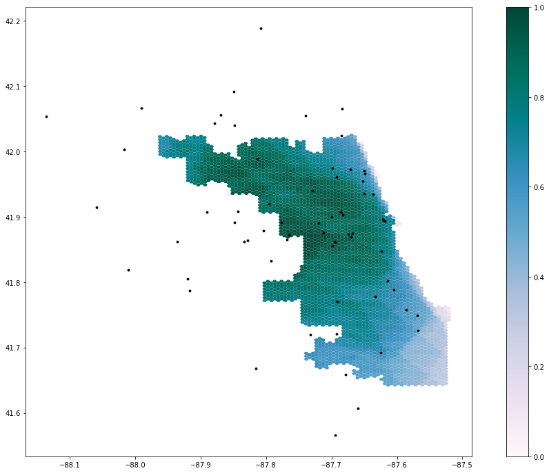
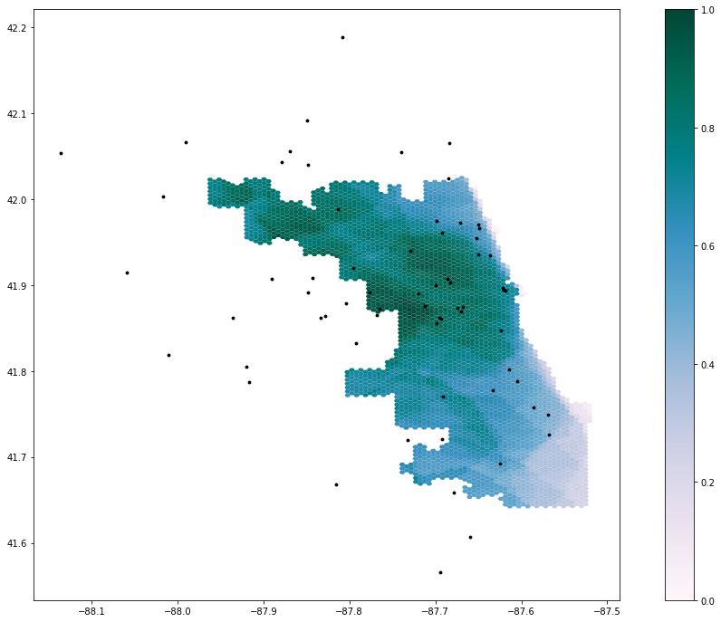

**Reproduction of**: Rapidly measuring spatial accessibility of COVID-19 healthcare resources: a case study of Illinois, USA

Original study *by* Kang, J. Y., A. Michels, F. Lyu, Shaohua Wang, N. Agbodo, V. L. Freeman, and Shaowen Wang. 2020. Rapidly measuring spatial accessibility of COVID-19 healthcare resources: a case study of Illinois, USA. International Journal of Health Geographics 19 (1):1–17. DOI:[10.1186/s12942-020-00229-x](https://ij-healthgeographics.biomedcentral.com/articles/10.1186/s12942-020-00229-x).

Reproduction Author: Drew An-Pham

Reproduction Materials Available at: [RP-Kang Repository](https://github.com/daptx/RP-Kang)

Created: `19 May 2021`
Revised: `26 May 2021`

## Introduction

The original study by [Kang et al. (2020)](https://ij-healthgeographics.biomedcentral.com/articles/10.1186/s12942-020-00229-x) aimed to rapidly measure the spatial accessibility of COVID‐19 healthcare resources (ICU beds & ventilators) in Illinois for both vulnerable populations—defined as people over 50-years old—and actual COVID-19 patients. To execute their analysis, an enhanced two-step floating catchment area (E2SFCA) method outlined by [Luo and Qi (2009)](https://www.sciencedirect.com/science/article/pii/S1353829209000574?via%3Dihub) was used; this looked at the outcome of interactions between demands (i.e. # of potential patients) and supply (i.e. # of beds of physicians). Their findings revealed an uneven distribution of healthcare resources across Illinois, with central and northern Chicago having greater access to these resources than southern Chicago.

In creating a methodology that was computationally efficient, geospatially scalable, and open source, their procedures were documented via a CyberGIS Jupyter Notebook, enabling anyone with access to reproduce of their study. As well, Kang et al (2020) have also maintained an open platform called [WhereCOVID-19](https://wherecovid19.cigi.illinois.edu/spatialAccess.html#7/40.000/-89.000/Dark_Mode-il_acc_i/370) to provide up-to-date information on healthcare availability.

Reproducing Kang et al's (2020) work is critical for verifying the results of their analyses, alongside giving students and other academics a stronger eye for critical investigations of research papers' methodologies. Additionally, by running and making comments/modifications to the original code, suggestions can be made to improve the original methods used. Together, both of these motives can help further the trustability and merit of Kang et al's (2020) paper in informing policymakers and public health practitioners about the allocation of healthcare resources or the distribution of healthcare infrastructure.

## Materials and Methods

The Python script (with inline comments & improvements) used for this reproduction can be found [here](https://github.com/daptx/RP-Kang/blob/main/COVID-19Acc.ipynb)

The data sources used for this reproduction matched those of Kang et al (2020):
- Road network data was obtained from [OpenStreetMap](https://www.openstreetmap.org/#map=4/38.01/-95.84) and accessed in the code via a Python Library called [OSMNX](https://github.com/gboeing/osmnx)
- Population data (census tracts) came from the [American Service Community](https://www.census.gov/programs-surveys/acs)
- Hospital data was collected from [US Homeland Infrastructure Foundation Level Data (HIFLD)](https://hifld-geoplatform.opendata.arcgis.com/datasets/hospitals/explore?location=7.501852%2C-15.457900%2C1.91)

Briefly outlining the methods used in the original study's [Jupyter Notebook](https://github.com/GIS4DEV/RP-Kang/blob/main/COVID-19Acc.ipynb) (learn more about this open source initiative [here](https://jupyter.org/about)) as modified by Joseph Holler, libraries and input files were first loaded, then road networks were processed to remove isolated nodes—self contained parts of the road network or dead ends. After, hospitals were snapped on to the nearest network nodes for the network analysis later. The code then created population centroids, derived catchment areas around hospitals, and calculated the influence of each hospital on their respective catchment area(s). Accessibility for each hospital was then measured and weighted by distance, proceeded by an overlap function that took sum of accessibility for each hexagon of the grid in the given grid shape file. The results (given as Geodataframes) were then normalized and visualized, producing a map of hospital accessibility across Chicago.

### Deviations from & Improvements to the Original Code

The largest problem identified in the original code was that the road network used was restricted to the bounds of Chicago. Therefore, regardless of their distance from Chicago the hospitals outside the city were not captured/accounted for in the road network. As a result, since the HIFLD hospital points included hospitals outside the city limit, these points were still snapped to their nearest nodes in the road network, creating a boundary effect inaccurately portraying accessibility along Chicago's periphery (i.e. northwest Chicago was false area of low accessibility). To fix this, a 15-mile buffer (~24 km) was applied to create a larger more inclusive road network, properly accounting for hospital points in the latter analysis.
```python
# Load and Plot Street Network
G = ox.graph_from_place('Chicago', network_type='drive', buffer_dist = 24140.2)
```

Once the buffer was added, errors in the OSM data syntax made it impossible to run the original code. For example, one-way streets with speed limits "25, east" could not be read by the code, which expected entries like "25 mph." To resolve this, try except code blocks were used to assign these hardcoded data errors Kang et al's (2020) default speed of 35 mph. Special thanks to [Maja Cannavo](https://majacannavo.github.io/geog323/geog323main) for troubleshooting and resolving this problem.
```python
# network_setting function
if (speed_type==str):
# add in try/except blocks to catch maxspeed formats that don't fit Kang et al's cases
  try:
    if len(data['maxspeed'].split(','))==2: # removes comma separation, turns into #s
      data['maxspeed']=float(data['maxspeed'].split(',')[0])                  
    elif data['maxspeed']=='signals':
      data['maxspeed']=35.0 # drive speed setting as 35 miles
    else:
      data['maxspeed']=float(data['maxspeed'].split()[0])
  except:
      data['maxspeed']= 35.0 # if error caught, code will go to this block and fill 35
else:
  try:
    data['maxspeed']=float(data['maxspeed'][0].split()[0])
  except:
    data['maxspeed']=35.0
```

Three other revisions made to the code to improve it's functionality were...
- **adding time benchmarks to key sections of the code**; These processing time outputs serves as a great metric for the quantifying the efficiency of Kang et al's (2020) code, connecting back to their intent of attaining rapid measurements spatial accessibility to COVID-19 healthcare resources
```python
%%time
'''
Example time output after function runs:
CPU times: user 1min 29s, sys: 2.03 s, total: 1min 31s
Wall time: 1min 31s
'''
```
- **altering the color palette of final map**; In cartography, the use of a red color scheme or red symbology often denotes exclusion or danger in a geopolitical context (van Houtum & Lacy, 2020). Since our final deliverable is looking at hospital accessibility, changing the color palette to a Purple, Blue, Green gradients strays away from this misinterpretation and adds aesthetic value.
```python
# out_put map function
 ax=output_grid.plot(column=resource, cmap='PuBuGn',figsize=(18,12), legend=True, zorder=1)
```
- **changing the original distance weights utilized**; Kang et al (2020) applied a set of weights (1.00, 0.68, & 0.22) to respective travel time zones (0-10, 10-20, & 20-30 min) to account for distance decay in their analysis. These weights were derived from Luo & Qi's (2009) paper, which the same E2SFCA method to assess spatial accessibility to primary care physicians in Northern Illinois. In their results, Luo & Qi (2009) reference a second weight set that represented a shaper distance decay: 1.00, 0.42, & 0.09. I applied these weights to further investigate the impact of distance weights on healthcare accessibility outcomes.
```python
# Run the Model Section
weights=[1.0, 0.42, 0.09] # weights where weights[0] is applied to distances[0]
```

## Results & Discussion
include images of findings (maps, graphs) and link to your final repository for the reproduction. Discuss what you learned from the reproduction attempt, especially any knowledge, insight, or uncertainty that was encoded in the repository or discovered in the reproduction but not explained in the published paper.





## Conclusion
with emphasis on the significance of the reproduction study you just completed. Was the study reproducible, and has the reproduction study increased, decreased, or otherwise refined your belief in the validity of the original study? Conclude with any insights, priorities, or questions for future research.

## Acknowledgments

## Notes on Style
 Remember that the primary motivation for reproduction and replication studies is not punitive. Frame your discussions in this report and previous reports in the constructive motivation for improving scientific knowledge through peer review. Project like CyberGISX generally, and the Kang et al 2020 publication specifically, are very new in geography, and our engagement with them should be both encouraging and constructive while emphasizing the value of open science.
