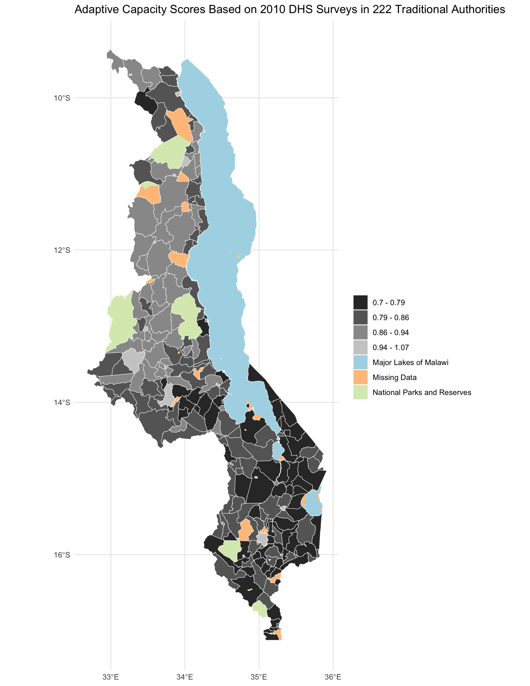
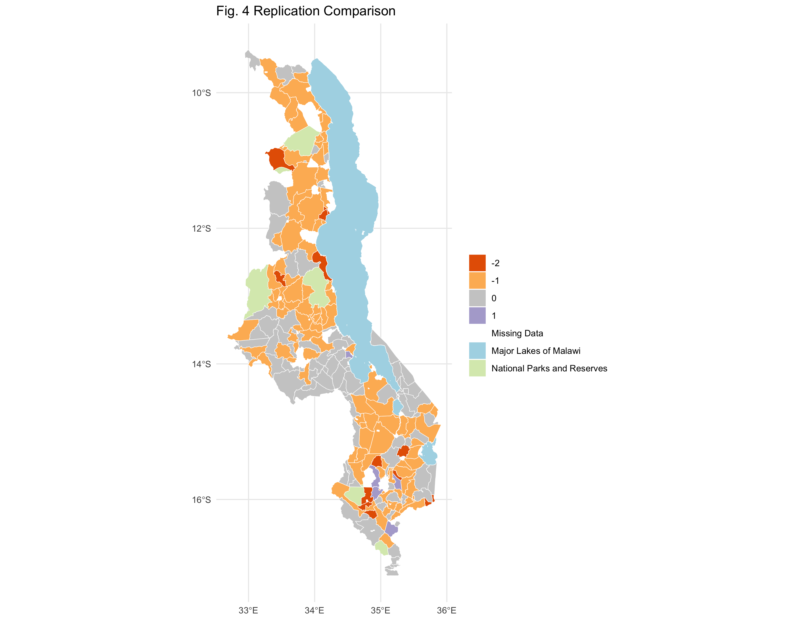
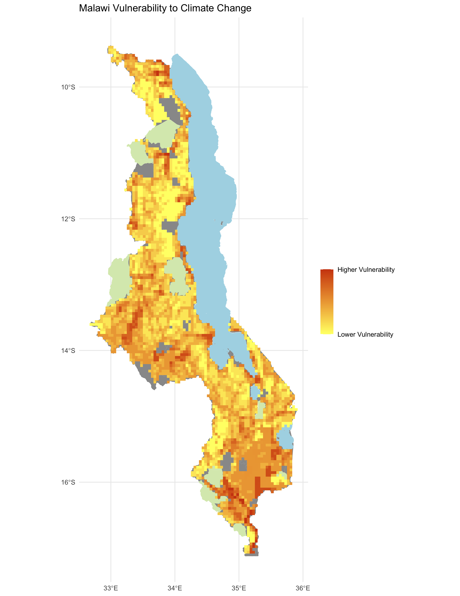
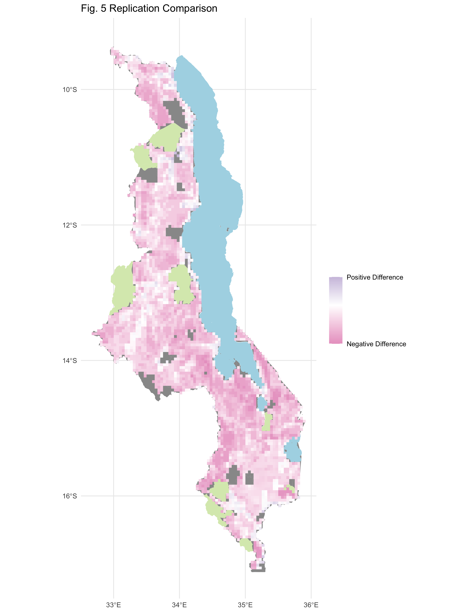
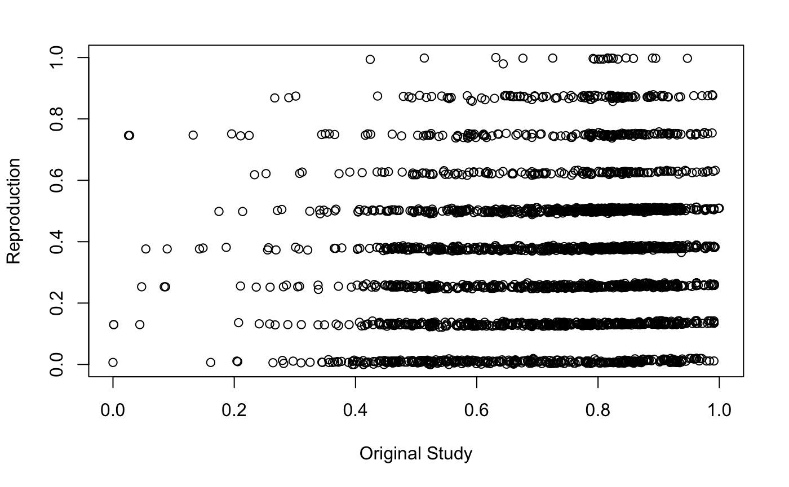
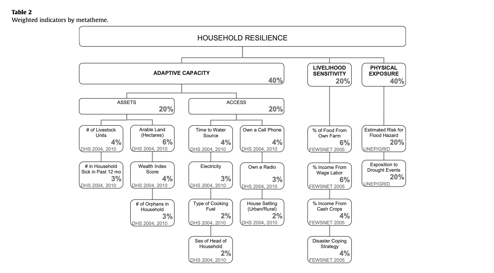

**Replication of**
# Vulnerability modeling for sub-Saharan Africa

Original study *by* Malcomb, D. W., E. A. Weaver, and A. R. Krakowka. 2014. Vulnerability modeling for sub-Saharan Africa: An operationalized approach in Malawi. *Applied Geography* 48:17–30. DOI:[10.1016/j.apgeog.2014.01.004](https://doi.org/10.1016/j.apgeog.2014.01.004)

Replication Authors:
Drew An-Pham, Joseph Holler, Kufre Udoh (Open Source GIScience students of Fall 2019), and fellow Open Source GIScience peers/co-collaborators of Spring 2021: Maja Cannavo, Emma Clinton, Jacob Freedman, Nick Nonnenmacher, and Alitzel Villanueva.

Replication Materials Available at: [RP-Malcomb Repository](https://github.com/daptx/RP-Malcomb)

Created: `14 April 2021`
Revised: `27 April 2021`

## Abstract

The original study is a multi-criteria analysis of vulnerability to Climate Change in Malawi, and is one of the earliest sub-national geographic models of climate change vulnerability for an African country. The study aims to be replicable, and had 40 citations in Google Scholar as of April 8, 2021.

## Original Study Information

The study region is the country of Malawi. The spatial support of input data includes DHS survey points, Traditional Authority boundaries, and raster grids of flood risk (0.833 degree resolution) and drought exposure (0.416 degree resolution).

The original study was published without data or code, but has detailed narrative description of the methodology. The methods used are feasible for undergraduate students to implement following completion of one introductory GIS course. The study states that its data is available for replication in 23 African countries.

## Data Description and Variables

This section was written collaboratively with fellow peers in GEOG 0323: Maja Cannavo, Emma Clinton, Jacob Freedman, Nick Nonnenmacher, and Alitzel Villanueva.

### *Access & Assets Data*

Demographic and Health Survey data are a product of the United States Agency for International Development (USAID). Variables contained in this dataset are used to represent adaptive capacity (access + assets) in the Malcomb et al’s (2014) study. These data come from survey questionnaires with large sample sizes. The DHS data used in our study were collected in 2010. In Malawi, the provenance of the DHA data dates back as far as 1992, but has not been collected consistently every year.

Each point in the household dataset represents a cluster of households with each cluster corresponding to some form of census enumeration units, such as villages in rural areas or city blocks in urban areas [DHS GPS Manual](assets/DHSmanual.pdf). This means that each household in each cluster has the same GPS data. While this data carries a high degree of precision, it may not best accurately represent target populations spatially, as each point represents a cluster of households, rather than individual homes. This data is collected by trained [USAID](https://www.usaid.gov/) staff using GPS receivers.

Missing data is a common occurrence in this dataset as a result of negligence or incorrect naming. However, according to the [DHS GPS Manual](assets/DHSmanual.pdf), these issues are easily rectified and typically sites for which data does not exist are recollected. Sometimes, however, missing information is coded in as such or assigned a proxy location.

The DHS website acknowledges the high potential for inconsistent or incomplete data in such broad and expansive survey sets. Missing survey data (responses) are never estimated or made up; they are instead coded as a special response indicating the absence of data. As well, there are clear policies in place to ensure the data’s accuracy. More information about data validity can be found on the [DHS’s Data Quality and Use site](https://www.dhsprogram.com/data/Data-Quality-and-Use.cfm). In this analysis, we use the variables listed in **Table 1** to determine the average adaptive capacity of each TA area. Data transformations are outlined below.

**Table 1:** Variables from DHS Data

| Variable Code | Definition |
| ------------- | ------------- |
| HHID | "Case Identification" |
| HV001 | "Cluster number" |
|HV002 | Household number |
| HV246A |"Cattle own" |
|HV246D | "Goats own"|
|HV246E | "Sheep own" |
|HV246G | "Pigs own" |
| HV248 |"Number of sick people 18-59"|
| HV245 | "Hectares for agricultural land"|
|HV271 | "Wealth index factor score (5 decimals)"|
|HV251 | "Number of orphans and vulnerable children"|
|HV207 | “Has Radio” |
| HV243A | “Has a Mobile Telephone”|
|HV219 | Sex of Head of Household”|
|HV226 | “Type of Cooking Fuel” |
| HV206 |"Has electricty” |
|HV204 |“Time to get to Water Source”|

**Variable Transformations**

1. Eliminate households with null and/or missing values
2. Join TA and LHZ ID data to the DHS clusters
3. Eliminate NA values for livestock
4. Sum counts of all different kinds of livestock into a single variable
5. Apply weights to normalized indicator variables to get scores for each category (assets, access)
6. find the stats of the capacity of each TA (min, max, mean, sd)
7. Join ta_capacity to TA based on ta_id
8. Prepare breaks for mapping
9. Class intervals based on capacity_2010 field
10. Take the values and round them to 2 decimal places
11. Put data in 4 classes based on break values

### *Livelihood Zones Data*

The Livelihood zone data is created by aggregating general regions where similar crops are grown and similar ecological patterns exist. This data exists originally at the household level and was aggregated into Livelihood Zones. To construct the aggregation used for “Livelihood Sensitivity” in this analysis, we use these household points from the FEWSnet data that had previously been aggregated into livelihood zones.

The four Livelihood Sensitivity categories are 1) Percent of food from own farm (6%); 2) Percent of income from wage labor (6%); 3) Percent of income from cash crops (4%); and 4) Disaster coping strategy (4%). In the original R script, household data from the DHS survey was used as a proxy for the specific data points in the livelihood sensitivity analysis (transformation: Join with DHS clusters to apply LHZ FNID variables). With this additional FEWSnet data at the household level, we can construct these four livelihood sensitivity categories using existing variables (Table 1).

The LHZ data variables are outlined in **Table 2**. The four categories used to determine livelihood sensitivity were ranked from 1-5 based on percent rank values and then weighted using values taken from Malcomb et al. (2014).


**Table 2:** Constructing Livelihood Sensitivity Categories

| Livelihood Sensitivity Category (LSC)  | Percent Contributing  | How LSC was constructed  |
| ------------- | ------------- | ------------- |
| Percent of food from own farm  |  6%  | Sources of food: crops + livestock  |
| Percent of income from wage labor  | 6%  | Sources of cash: labour etc. / total * 100  |
| Percent of income from cash crops  | 4%  | sources of cash (Crops): (tobacco + sugar + tea + coffee) + / total sources of cash * 100  |
| Disaster coping strategy  | 4%  | Self-employment & small business and trade: (firewood + sale of wild food + grass + mats + charcoal) / total sources of cash * 100  |

**Variable Transformations**

1. Join with DHS clusters to apply LHZ FNID variables
2. Clip TA boundaries to Malawi (st_buffer of LHZ to .01 m)
3. Create ecological areas: LHZ boundaries intersected with TA boundaries to clip out park/conservation boundaries and rename those park areas with the park information from TA data), combined with lake data to remove environmental areas from the analysis

### *Physical Exposure: Floods + Droughts*

**Floods:** This dataset stems from work collected by multiple agencies and funneled into the PREVIEW Global Risk Data Platform, “an effort to share spatial information on global risk from natural hazards.” The dataset was designed by UNEP/GRID-Europe for the Global Assessment Report on Risk Reduction (GAR), using global data. A flood estimation value is assigned via an index of 1 (low) to 5 (extreme). The data use the WGS 1984 datum and is comprised of raster grids with 0.833 degree resolution.

**Drought:** This dataset uses the Standardized Precipitation Index to measure annual drought exposure across the globe. The Standardized Precipitation Index draws on data from a “global monthly gridded precipitation dataset” from the University of East Anglia’s Climatic Research Unit, and was modeled in GIS using methodology from Brad Lyon at Columbia University. The dataset draws on 2010 population information from the LandScanTM Global Population Database at the Oak Ridge National Laboratory.  Drought exposure is reported as the expected average annual (2010) population exposed. The data were compiled by UNEP/GRID-Europe for the Global Assessment Report on Risk Reduction (GAR). The data use the WGS 1984 datum, span the years 1980-2001, and are reported in raster format with spatial resolution 1/24 degree x 1/24 degree.

**Variable Transformations**

1. Load in UNEP raster
2. Set CRS for drought to EPSG:4326
3. Set CRS for flood to EPSG:4326 1.Reproject, clip, and resample based on bounding box (dimensions: xmin = 35.9166666666658188, xmax = 32.6666666666658330, ymin = -9.3333333333336554, ymax = -17.0833333333336270) and resolution of blank raster we created: resolution is 1/24 degree x 1/24 degree
4. Use bilinear resampling for drought to average continuous population exposure values
5. Use nearest-neighbor resampling for flood risk to preserve integer values

### Analytical Specification

The original study was conducted using ArcGIS and STATA, but does not state which versions of these software were used.
The replication study will use R.

## Materials and Procedure

*Process Adaptive Capacity*

1. Bring in DHS Data [Households Level] (vector)
2. Bring in TA (Traditional Authority boundaries) and LHZ (livelihood zones) data
3. Get rid of unsuitable households (eliminate NULL and/or missing values)
4. Join TA and LHZ ID data to the DHS clusters
5. Pre-process the livestock data, Filter for NA livestock data, Update livestock data (summing different kinds)
6. FIELD CALCULATOR: Normalize each indicator variable and rescale from 1-5 (real numbers) based on percent rank
7. FIELD CALCULATOR / ADD FIELD: Apply weights to normalized indicator variables to get scores for each category (assets, access)
8. SUMMARIZE/AGGREGATE: find the stats of the capacity of each TA (min, max, mean, sd)
9. Join ta_capacity to TA based on ta_id
10. Prepare breaks for mapping, class intervals based on capacity_2010 field, take the values and round them to 2 decimal places, and put data in 4 classes based on break values
11. Save the adaptive capacity scores

*Process Livelihood Sensitivity*

1. Load in LHZ csv into R
2. Join LHZ sensitivity data into R code
3. Create livelihood sensitivity score data based on breakdown provided in the report (Table 2)

*Process Physical Exposure*

1. Load in UNEP rasterSet CRS for drought
2. Set CRS for flood
3. Clean and reproject rasters
4. Create a bounding box at extent of Malawi, Add geometry info and precision (st_as_sfc)
5. RASTERIZE the adaptive capacity data with pixel data corresponding to capacity_2010 field
6. RASTERIZE the livelihood sensitivity score with pixel data corresponding to capacity_2010 field
7. SUM RASTERS: Combine adaptive capacity and livelihood sensitivity rasters
8. For Drought: use bilinear to average continuous population exposure values
9. For Flood: use nearest neighbor to preserve integer values
10. RASTER CALCULATOR: a) Create a mask; b) Reclassify the flood layer (quintiles, currently binary); c) Reclassify the drought values (quantile [from 0 - 1 in intervals of 0.2 =5]); d) Add component rasters for final weighted score of drought + flood; e) Combine with adaptive capacity and livelihood zone data
11. CLIP the traditional authorities with the LHZs to cut out the lake
12. AGGREGATE: Create final vulnerability layer using environmental vulnerability score and ta_capacity

We then georeferenced maps from the original study using QGIS in order to compare the results generated by our R script to those found in Malcomb et al. (2014). We ran a Spearman's Rho correlation test between the two maps of Figures 4 & 5 from the original study to determine the differences in results.

## Reproduction Results

The reproduction appears to support Malcomb et al.'s (2014) findings for adaptive capacity at the Traditional Authorities level (Figure 4 in the original study). A difference maps (fig. 2) highlights the general agreement between our adaptive capacity map (fig. 1) and the georeferenced/digitized map of adaptive capacity in 2010 from Malcomb et al. (2014), where most traditional authorities matched with or were within one class break of the original value. A confusion matrix comparing the two maps (table 3) yielded a Spearman’s rho value of 0.786, indicating a relatively strong correlation between the original study and the reproduction.

Inversely, our results failed to effectively reproduce Malcomb et al.'s (2014) assessment of climate vulnerability in Malawi. The reproduction (fig 3.) appears to have yielded general disagreement with georeferenced/digitized map of climate vulnerability from Malcomb et al. (2014), as seen in the produced difference map (fig. 4). A confusion matrix comparing the two maps yielded a Spearman’s rho value of 0.202, indicating a low degree of correlation between the original study and the reproduction. This disagreement is further visualized in the scatterplot of vulnerability scores from the reproduction vs the original study (fig 5.), where a linear arrangement of the points would indicate a strong correlation. However, in this case, the reproduction appears to have consistently yielded lower vulnerability scores, causing a skew in the distribution of points.


*figure 1. Reproduction results of adaptive capacity (access + assets) scores by traditional authority (TA).*

Note: In the original study, the adaptive capacity scores ranged from 11-25, whereas those in the reproduction go from 0.7-1.07. The original R-code created by Kufre Udoh and Joseph Holler multiplied 2010 capacity values by 20 to give a closer value to those in the original study. I chose to remove this line of code from the reproduction, as I believe that our code should attempt to independently reproduce the results, not match our approximate findings to the original through an arbitrary transformation of the capacity score. This revision was made in R by adding a # to keep the *20 from running, while still preparing the data for visualization breaks as created in the original study.

```r
# ta = mutate(ta, capacity_2010 = capacity_2010 * 20)
```


*figure 2. Map of the difference between the adaptive capacity (access + assets) scores of the reproduction vs. the original study (difference = reproduction score - original score).*

**Table 3:** Matrix comparing Malcomb et al.'s (2014) results to the reproduction via a pearman’s rho correlation test (rho = 0.7860921). The results of the original study are shown on the x axis (columns), while the results of the reproduction are shown on the y axis (rows).

|   | 1  | 2  | 3  | 4 |
| 1 | 35 | 5  | 0  | 0 |
| 2 | 27 | 26 | 0  | 0 |
| 3 | 5  | 44 | 19 | 0 |
| 4 | 0  | 7  | 28 | 4 |


*figure 3. Reproduction results for vulnerability score in Malawi*


*figure 4. Map of the difference between the final vulnerability scores of the reproduction vs the original study.*


*figure 5. Scatterplot comparing final vulnerability scores from the results of the reproduction to those of the original study, where difference = reproduction score - original score (rho = 0.2018834).*

Note: There appears to be an odd discretization of our values in this scatterplot. This can likely attributed to an earlier categorization of points by reproduction scores in the R-code that was overlooked or a lack of decimal precision that could've produced values more alike/similar to each other. Although not clear, the significance of this graphic can still be found in how well it visually depicts our calculated rho of 0.2018834.

## Unplanned Deviations from the Protocol

Prior to investigating the data, our initial interpretation and recreation the original study's workflow outlined various areas of uncertainty. Malcomb et al.'s (2014) methodology created confusion as to how the DHS data was brought (at the household, village, or district level). As well, the description of DHS indicators as 'disaggregated' brought up further uncertainty as to the scales were suppose to transform the data. This ambiguity led to the bulk of uncertainty in the reproduction analysis.

As well, Malcomb et al.'s (2014) methodology states to have normalized indicators by using "zero [to represent] the worst condition for a household and five [for] the best," but then proceeded to refer to households using quintiles (the former statement alludes to sextiles, however). To work around this source of uncertainty, our group decided to use quintiles and assigned values of 1-5 when normalizing our data. Within this normalization, however, there was uncertainty as to how binary variables (i.e. sex) were normalized on a 1-5 scale. For these, we assigned a value of 1 to the presumed lower-risk option (i.e. male) and a value of 2 to the higher-risk (i.e. female).

With the livelihood sensitivity scores, another main source of uncertainty came about when figuring out how to quantify the 4 indicators of livelihood sensitivity, especially "disaster coping strategy. The original report was unclear in which variables were used to calculate the livelihood zone scores, along with if these data were from only the “poor” category or also included those in the “middle-class” and “rich” calculations of livelihood sensitivity. **Table 2** in the **Data Description and Variables** section spotlights how our group approached these sources of uncertainty.

*figure 6.* Table 2 from Malcomb et al.(2014) – Calculating Household Resilience Score


## Discussion

While our attempt at reproducing Malcomb et al.'s (2014) classification of adaptive capacity had a strong degree of success, the same can't be said for the reproduction of climate vulnerability in Malawi. Even though we were able to repurpose the provided R-code to successfully create the vulnerability model itself, its results rarely matched the original results by Malcomb et al. (2014), as indicated by Spearman's correlation test yielding rho = 0.2018834. The failure in our results can be attributed to the lack of code for data processing, the lack of clear workflow documentation, and fuzzy writing when describing key methodologies (i.e. how data was used, aggregated, and normalized in the analysis). Overall, these factors compounded into a large pool of uncertainty, pushing our group to fill in these gaps as best we could (i.e. constructing and calculating our own livelihood sensitivity categories).

To better understand our reproduction and assess Malcomb et al.'s (2014) paper, it's useful to look to Eric Tate's (2013) research on uncertainty in vulnerability models. Under Tate's framework, Malcomb et al. (2014) used a hierarchical model structure to index and combine variables for vulnerability mapping. The indicator set used for this hierarchy were mainly constructed through a deductive, normative, and practical approach, where cited literature and consultation with 'data experts' in Malawi, and the use of readily available data were essential to forming and justifying variables used in their model. The analysis was conducted primarily at the Traditional Authorities level, where raster grids were used to create one synchronous format for all the classification categories (adaptive capacity, livelihood sensitivity, & physical exposure). Each data experienced different transformations, as noted in the **Data Description and Variables** section, but were all normalized using 0-5 quintiles and were weighted via a normative approach (consultation with experts). The final outputs for each category were aggregated using the Traditional Authority boundaries and an additive approach, where indicators did not interact with each other. More specifically, each 'category weight' was independent/stood on its on. Uncertainty was overlooked in the original paper, where gaps in the data, results, and mean outputs being visualized were negligible. To approach this uncertainty, Malcomb et al (2014) could have implemented a Monte Carlo simulation to assess different variables and weightings throughout the code, illuminating how much the choices of researchers affect final vulnerability outcomes.

This mention of 'choice' also alludes to the varying degrees of subjectivity used with our reproduction. Although our interpretations of indicators within livelihood sensitivity were responsible for deviations from the original study once normalized, weighted, and visualized, subjectivity is not inherently a bad thing, and is necessary to some degree in modeling efforts (Tate, 2013). Once again, these decisions however link back to the lack of a clear methodology within Malcomb et al (2014) in the first place.

## Conclusion

Our attempt at reproducing a climate vulnerability model and ending up with a poorly correlated result (despite having 100% of the data AND the original paper to deconstruct) is quite telling of the challenges that arise in reproducing scientific works and highlights the value of transparency and explicitness (i.e. access to code) when publishing research. In creating an atmosphere of robust and dynamic research, being able to reproduce and replicate work becomes essential in building theory and making the field of spatial research (even research in general) more accessible to the public and academics—going back to the discussion of the value of open source (even though 80% of the data was initially available, 100% was accessed in the end).

Despite these obstacles within our reproduction attempt, we found success in our map of adaptive capacity (figure 1.), which came fairly close to matching the results from Malcomb et al. (2014). Hence, the intermediary steps integrating both livelihood sensitivity and physical exposure into the overall resilience score can be seen as the breeding ground for uncertainty and error for the remainder of our analysis. Inaccuracies and irreproducibility here were likely based around a lack of transparency within the initial analysis towards data, aggregation, code, and processing capacities.

Overall, our findings suggest a need to further explore and reproduce existing research that addresses social vulnerability and well-being across various scales/domains. In our case, Malcomb et al. (2014) would be a strong place to start. Having gone through this reproduction once, future steps that would be required in order to truly test for reproducibility and replicability would be to have access to the code utilized in this study and further clarity of the methodology, both of which in theory would hopefully yield a high rho value (>0.9) under the Spearman correlation test. A successful reproduction of this study would thus enable us to truly assess vulnerability to climate change in Malawi (considering temporal changes and local conditions), creating a model which could serve as a proxy/indicator for future natural disaster threats and improve of the overall human and environmental well-being of Malawians and sub-Saharan Africans (if replicated).

## Acknowledgements

To my co-collaborators, thank y'all for being such a supportive and motivating group through each stage of this reproduction, from our initial pre-analysis of Malcomb et al.'s (2014) paper to bringing together our R code in the final hours. In particular, special thanks to Jacob Freedman for his R-coding expertise when it came to processing/calculating the livelihood sensitivity scores. As well, shout out to Emma Clinton for helping me troubleshoot the R-code for the comparison figures (*figures 2 & 4*) and to Vincent Falardeau for supplementing the R-code that produced *figure 2*.

## References

Malcomb, D. W., E. A. Weaver, and A. R. Krakowka. 2014. Vulnerability modeling for sub-Saharan Africa: An operationalized approach in Malawi. Applied Geography 48:17–30. DOI:10.1016/j.apgeog.2014.01.004

Tate, E. 2013. Uncertainty Analysis for a Social Vulnerability Index. Annals of the Association of American Geographers 103 (3):526–543. doi:10.1080/00045608.2012.700616.

####  Report Template References & License

This template was developed by Peter Kedron and Joseph Holler with funding support from HEGS-2049837. This template is an adaptation of the ReScience Article Template Developed by N.P Rougier, released under a GPL version 3 license and available here: https://github.com/ReScience/template. Copyright © Nicolas Rougier and coauthors. It also draws inspiration from the pre-registration protocol of the Open Science Framework and the replication studies of Camerer et al. (2016, 2018). See https://osf.io/pfdyw/ and https://osf.io/bzm54/

Camerer, C. F., A. Dreber, E. Forsell, T.-H. Ho, J. Huber, M. Johannesson, M. Kirchler, J. Almenberg, A. Altmejd, T. Chan, E. Heikensten, F. Holzmeister, T. Imai, S. Isaksson, G. Nave, T. Pfeiffer, M. Razen, and H. Wu. 2016. Evaluating replicability of laboratory experiments in economics. Science 351 (6280):1433–1436. https://www.sciencemag.org/lookup/doi/10.1126/science.aaf0918.

Camerer, C. F., A. Dreber, F. Holzmeister, T.-H. Ho, J. Huber, M. Johannesson, M. Kirchler, G. Nave, B. A. Nosek, T. Pfeiffer, A. Altmejd, N. Buttrick, T. Chan, Y. Chen, E. Forsell, A. Gampa, E. Heikensten, L. Hummer, T. Imai, S. Isaksson, D. Manfredi, J. Rose, E.-J. Wagenmakers, and H. Wu. 2018. Evaluating the replicability of social science experiments in Nature and Science between 2010 and 2015. Nature Human Behaviour 2 (9):637–644. http://www.nature.com/articles/s41562-018-0399-z.
