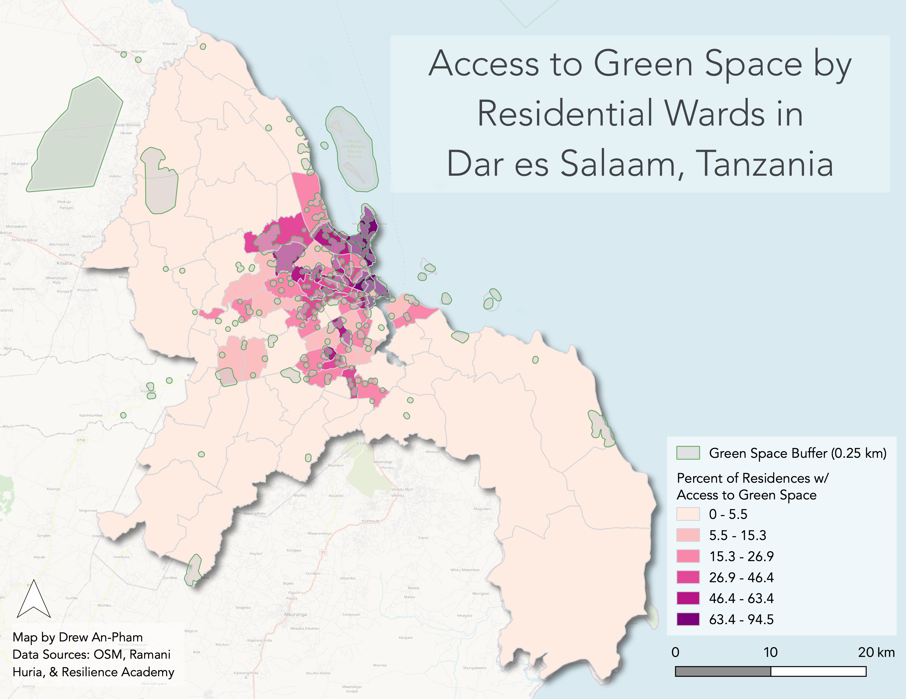

## Guiding Question

*What percentage of residences in each of Dar es Salam's administrative wards are with 0.25 kilometers (a 3-minute walk) of a public green space?*

In this analysis, we used SQL queries in PostGIS to answer this simple spatial question pertaining to urban resilience & environmental justice in Dar es Salaam, Tanzania. This analysis was done in collaboration with [Emma Clinton](https://emmaclinton.github.io/), GIS aficionado and Conservation Biology student at Middlebury College.

## Accessing Data

 |  | 

The green space and residential data used in this analysis were derived from [OpenStreetMap](https://www.openstreetmap.org/#map=10/-6.8767/39.2287), a collaborative mapping effort aimed at sourcing geodata from the public (relating to the concept of [open source](https://opensource.org/osd)). Data collected for OSM comes from various parties (individuals, research groups, organizations, etc.), where information around the collection is built into the data via a unique identifier and timestamp. For users of OSM, this resource can be helpful for identifying who collected data and when that data was collected for a given space, providing background context that may allude to benefits and gaps within the open source data. In our case, a large portion of contributors to our used dataset were members of [Ramani Huria](https://ramanihuria.org/en/), a community-based mapping project concerned about flood resilience and development in Dar es Salaam. The OSM data downloaded and pushed into our PostGIS database for this analysis was provided by Joseph Holler, Assistant Professor of Geography at Middlebury College.


[Administrative wards data](https://geonode.resilienceacademy.ac.tz/layers/geonode_data:geonode:dar_es_salaam_administrative_wards) was downloaded from the [Resilience Academy](https://geonode.resilienceacademy.ac.tz/), a digital geospatial data repository with WMS raster and WFS feature services that supports research, education, and disaster-risk management practices. Note: The Resilience Academy is one of several projects created by Ramani Huria.   

## Methods

*All sql queries used for this analysis can be found [here](assets/x) for replication*

Our objectives for this analysis are as follows:
- a. to create a vector layer of points representing residential buildings in Dar es Salaam
- b. to determine how many residences are contained within each ward
- c. to filter and pick out green spaces & apply a 0.25 km buffer for accessibility
- d. to calculate how many residences in each ward fall within the green space buffers
In junction, these steps will enable us to run our final calculation, looking at the percentage of residences within an accessible distance of a green space per ward. We acknowledge a network analysis would increase the accuracy of our findings, however, given the learning curve of SQL, we decided to use a buffer for simplicity's sake.

For this analysis, we used the Database Manager within QGIS to access data from Dar es Salaam via the PostGIS database.

First, we will select the residential buildings within Dar es Salaam. Here, we define residential buildings as any point/polygon that is NOT listed as an amenity and has a building tag of 'yes' or 'residential.'

*What is a tag exactly?* In OSM, data is organized in the form of **tags**, which consists of two parts: a *key* and a *value* expressed as key="value." The key defines the categrory of the object, while the value is used to enumerate or further describe the properties of the feature. A goos example of this would be landuse="industrial." The key would be landuse, specifying the feature as a space primarily used by human, and the value would be industrial, meaning the type of feature would be one thats predominantly industrial—such as workshops, factories, or warehouses. Thus, these key value pair will allow us to pick out the residential and greenspace features we want to use in our analysis.

```sql
/* First, lets make a table of the OSM point features that are residential buildings
By default, PostGIS 'does not understand' the type of geometry its getting, so we type-cast
it with ::geometry(geometrytype,SRID) with the parameters being the geometry type & SRID */

CREATE TABLE buildings_point AS
SELECT osm_id, building, amenity, st_transform(way,32737)::geometry(point,32737) as geom,    
  osm_user, osm_uid, osm_version, osm_timestamp
FROM public.planet_osm_point
WHERE amenity IS NULL
AND building IS NOT NULL;

ALTER TABLE buildings_point
ADD COLUMN res real;

UPDATE buildings_point
SET res = 1
WHERE building = 'yes' OR building = 'residential';

DELETE FROM buildings_point
WHERE res IS NULL;

ALTER TABLE buildings_point
DROP COLUMN amenity;
```

We then repeat this process for the polygon features to ensure our analysis is inclusive of all residences, as contributors to OSM will vary what geometry type they use when inserting geodata.

```sql
CREATE TABLE buildings_poly AS
SELECT osm_id, building, amenity, st_transform(way,32737)::geometry(polygon,32737) as geom,
  osm_user, osm_uid, osm_version, osm_timestamp
FROM public.planet_osm_polygon
WHERE amenity IS NULL
AND building IS NOT NULL;

ALTER TABLE buildings_poly
ADD COLUMN res real;

UPDATE buildings_poly
SET res = 1
WHERE building = 'yes' OR building = 'residential';

DELETE FROM buildings_poly
WHERE res IS NULL;
```

When using SQL, keeping geometries smaller whenever possible is better, as it will in query processing for larger data files. Hence, we now want to convert our residential polygons into points via the centroids tool to ease our analysis, then merge these features with the points layer to create a composite point layer for residences.

```sql
/* Lets convert the polygons to centroids to simplify the geometries. */

CREATE TABLE buildings_centroids AS
SELECT osm_id, building, osm_user, osm_uid, osm_version, osm_timestamp, st_centroid(geom)::geometry(point,32737) as geom
FROM buildings_poly;

/* Now, union the points together to create a single point layer/table of residences */

CREATE TABLE unionres AS
SELECT osm_id, building, st_transform(geom,32737)::geometry(point,32737) as geom, osm_user, osm_uid, osm_version, osm_timestamp
FROM buildings_point
UNION
SELECT osm_id, building, st_transform(geom,32737)::geometry(point,32737) as geom, osm_user, osm_uid, osm_version, osm_timestamp
FROM buildings_centroids;
```
Our analysis will be visualized using the ward_census layer, so we need to join the information about the wards to the residences point layer. We'll use the spatial relationship between residential points and wards to assign a “ward_name” value to residential points.

```sql
/* Join the wards data to the unionres table. */

ALTER TABLE unionres
ADD COLUMN ward_name text;

UPDATE unionres
SET ward_name = ward_census.ward_name
FROM ward_census
WHERE st_intersects(unionres.geom, st_transform(ward_census.utmgeom,32737));
```

Now, lets count the number the number of residences per ward, as we will use this value in our final percentage calculation of residences with access to green space within each ward.

```sql
/* Count the number of residences per ward */

ALTER TABLE ward_census
ADD COLUMN res_count int;

/* Alter table "ward census" by adding counts of the residences contained within each ward:*/

UPDATE ward_census
SET res_count = (SELECT count(*) FROM unionres WHERE unionres.ward_name = ward_census.ward_name);
```

Shifting from the wards, we will now define and select our green spaces, filtering by public accessibility and by what we define as a green space, using the key="value" format.

```sql
/* Filter by public accessibility */

CREATE TABLE greenspace AS
SELECT osm_id, access, leisure, landuse, "natural", st_transform(way,32737)::geometry(polygon,32737) as geom, osm_user, osm_uid, osm_version, osm_timestamp
FROM public.planet_osm_polygon
WHERE access = 'yes' OR access = 'permissive' OR access IS NULL;

/* Filter by type of green space, based on OSM key values */

ALTER TABLE greenspace
ADD COLUMN green real;

UPDATE greenspace
SET green = 1 WHERE leisure = 'common' OR leisure = 'dog_park'
OR leisure = 'garden' OR landuse = 'greenfield' OR landuse = 'grass'
OR leisure = 'nature_reserve' OR 	leisure = 'park' OR leisure = 'pitch'
OR landuse = 'recreation_ground' OR landuse = 'village_green' OR landuse = 'forest'
OR "natural" = 'wood' OR "natural" = 'grassland' OR "natural" = 'shrub' OR landuse = 'allotments';

DELETE FROM greenspace
WHERE green IS NULL;
```

Now that we have our defined green spaces, lets create our buffers and pick out the residential points that fall within them.

```sql
/* Buffer the green spaces by an accessible distance (in our case, 0.25 km) */

CREATE TABLE greenbuffer AS
SELECT osm_id, st_buffer(geom, 250)::geometry(polygon,32737) as geom from greenspace;

/* Intersect the points with the green space buffer to differentiate points that are
within a buffer from those that are not */

ALTER TABLE unionres
ADD COLUMN green int;

UPDATE unionres
SET green = 1
FROM greenbuffer
WHERE st_intersects(unionres.geom, st_transform(greenbuffer.geom,32737));
```

We then repeat the process of counting points within polygons that we used above to determine the number of points in each buffer.

```sql
/* Count the number of residences with green space accessibility per ward */

ALTER TABLE ward_census
ADD COLUMN green_count int;

/* Alter table "ward census" by adding counts of the residences contained within each ward */

UPDATE ward_census
SET green_count = (SELECT count(*) FROM unionres WHERE unionres.ward_name = ward_census.ward_name AND unionres.green = 1);
```

We've now accomplished all of our objectives! Finally, we can calculate the percent of residences within 0.25 km of green spaces per ward.

```sql
/* Calculate the percentage of the residences in each ward that are within 0.25 km
of a publicly accessible green space */

ALTER TABLE ward_census
ADD COLUMN greenpct real;

UPDATE ward_census
SET greenpct = CAST(@green_count AS FLOAT) / CAST(@res_count AS FLOAT) * 100;
```

## Results

A published Leaflet web map of our results can be found [here](https://emmaclinton.github.io/DSM_sql/assets/index.html#10/-6.8739/39.2547).

Our analysis and final cartographic layouts (both web and static) reveal the majority of wards with high access to green space were well-developed and organized areas of the Dar es Salaam near the coast (*fig. a*).


*figure a.* A static map of percent of residences by ward within 0.25km of green space in Dar es Salaam.


**DATA SOURCES:**

Greenspaces and residences: OpenStreetMap contributors (2021). Retrieved from https://planet.openstreetmap.org.

Wards: RamaniHuria.

**REFERENCES:**

Bhanjee, S. and Zhang, C. (2018). Mapping latest patterns of urban sprawl in Dar es Salaam, Tanzania. Papers in Applied Geography, 4(2):1-13. http://dx.doi.org/10.1080/23754931.2018.1471413.

Karutz R., Berghöfer A., Moore L.R., and van Wyk, E. (2019). A Thematic Atlas of Nature’s Benefits to Dar es Salaam. Leipzig and Cape Town: Helmholtz Centre for Environmental Research and ICLEI Africa Secretariat. 78 pages. http://dcc.go.tz/storage/app/uploads/public/5db/aef/cf8/5dbaefcf875ec366483118.pdf.

Kombe, J.W.M. (1994). The demise of public urban land management and the emergence of informal land markets in Tanzania: A case of Dar-es-Salaam city. Habitat International, 18(1):23-43. https://www.sciencedirect.com/science/article/pii/019739759490037X?via%3Dihub.

Msuya, I., Moshi, I., and Levira, F. (2020). Dar es Salaam: the unplanned urban sprawl threatening neighborhood sustainability. Centre for Sustainable, Healthy and Learning Cities and Neighborhoods. http://www.centreforsustainablecities.ac.uk/research/dar-es-salaam-the-unplanned-urban-sprawl-threatening-neighbourhood-sustainability/.
