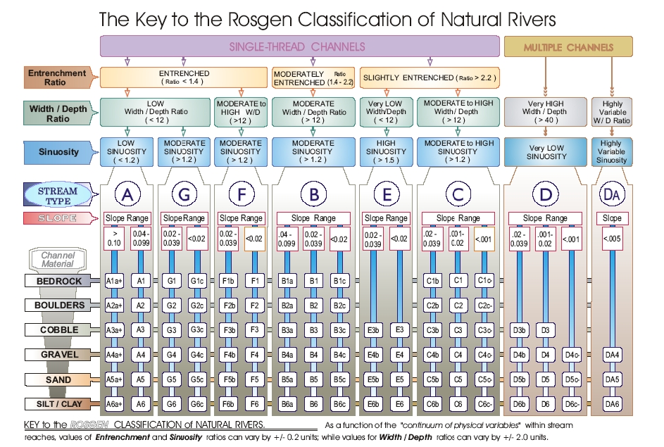
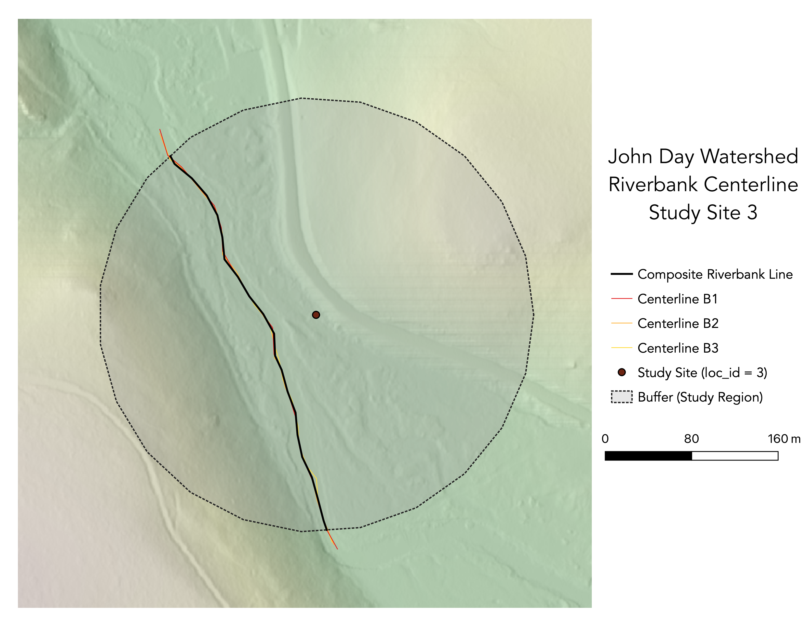
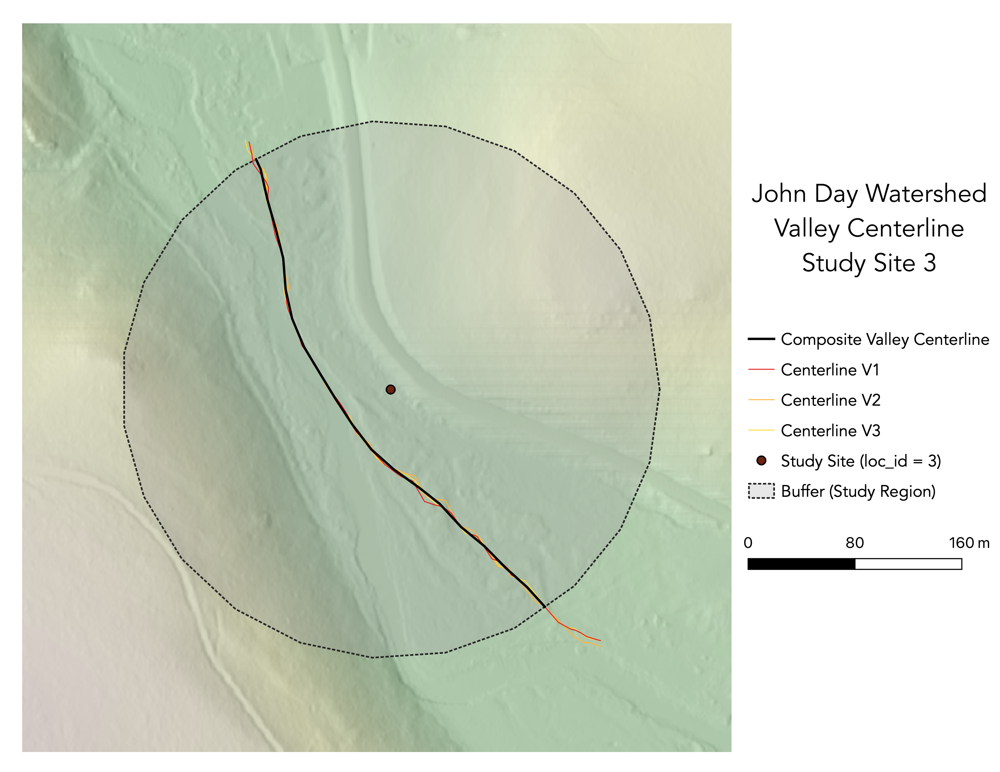
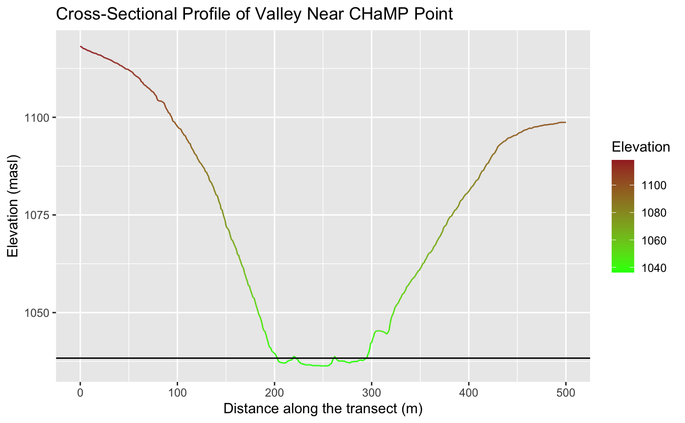

**Replication of**
# A classification of natural rivers

Original study *by* Rosgen, D. L.
*in* *CATENA* 22 (3):169–199. https://linkinghub.elsevier.com/retrieve/pii/0341816294900019.

and Replication by: Kasprak, A., N. Hough-Snee, T. Beechie, N. Bouwes, G. Brierley, R. Camp, K. Fryirs, H. Imaki, M. Jensen, G. O’Brien, D. Rosgen, and J. Wheaton. 2016. The Blurred Line between Form and Process: A Comparison of Stream Channel Classification Frameworks ed. J. A. Jones. *PLOS ONE* 11 (3):e0150293. https://dx.plos.org/10.1371/journal.pone.0150293.

Replication Authors: Drew An-Pham
Your Name, Zach Hilgendorf, Joseph Holler, and Peter Kedron.

Replication Materials Available at: [Re-Rosgen](https://github.com/daptx/RE-rosgen)

Created: `17 March 2021`
Last Revised: `24 March 2021`

## Abstract & Motivation

The classification of rivers and streams has served as a means to approach the long-standing discourse of understanding the dynamic physical processes that influence the patterns and characteristics of these features. The Rosgen Classification System (RCS), a stream-reach taxonomy commonly applied to streams/watersheds in North America, is a primary example of a standardized classification scheme that has been used to make streams more communicable and accessible across disciplines (geomorphology, conservation planning, engineering, so on so forth). Established in *A classification of natural rivers*, Rosgen (1994) created a classification hierarchy of 7 major stream type categories based on factors of entrenchment, gradient, width/depth ratio, and sinuosity. Each category was then iterated with sub-types, delineated by dominant channel material—pointing to a ‘final classification’.

In *The Blurred Lines between Form and Process: A Comparison of Stream Channel Classification Frameworks*, Kasprak et al. (2016) attempted to replicate and test the Rosgen Classification System (RCS), alongside 3 other classification frameworks. In their methodology, Kasprak et al. (2016) classified 33 Columbia Habitat Monitoring Program (CHaMP) reaches in the Middle Fork John Day Basin (MFJD; located in Oregon) using Levels I & II of the RCS, in addition to using 10 and 0.1-meter resolution DEMS and 1-meter resolution aerial imagery (implying the use of LiDAR).

Our study aims to replicate the results of Kasprak et al. (2016)—a replication of the Rosgen Classification in and of itself—using open source GIS (GRASS & QGIS) and statistical software (RStudio). Our replication uses both Columbia Habitat Monitoring Program (CHaMPs) data and the 1-meter resolution DEM LiDAR data for the study region to derive Level I & II classifications for a randomly assigned reach in the John Day River Watershed. While our software diverges from the original study, our end-goal remains to see whether these different methods create a synonymous stream type identification to Kasprak et al. (2016).

### Sampling Plan & Data Description

For this study, we were each assigned a random site from the original study to analyze. My designated stream reach was loc_id = 3.

*figure a. John Day Watershed Extent & CHaMP Sites Selected by Kasprak et al (2016)*

## Materials & Procedure

This report is to assess if the watershed-scale classifications by Kasprak et al. (2016) can be entirely replicated with open-source GIS and statistical software. Both our study and Kasprak et al. (2016) use the CHaMP points for specific site classification, with Kasprak using points from 2012-2013 and ours ranging from 2011-2017. At my site (loc_id = 3) there were 2 sampled points from 2012-2013, and random selection led to using the 2012 point for this study.

For this replication study, we utilized both GRASS and RStudio, following a workflow prepared and edited by Zach Hilgendorf—Geography Ph.D. Student @ ASU and Joesph Holler—Geography Professor @ Middlebury College.

The detailed procedures and protocols for our GRASS analysis can be found [here](https://github.com/daptx/RE-rosgen/blob/main/procedure/protocols/1-Research_Protocol_GRASS.pdf), while instructions for RStudio can be found [here](https://github.com/daptx/RE-rosgen/blob/main/procedure/protocols/3-Classifying.pdf), along with the respective [code](assets/2-ProfileViewer.Rmd) created by Zach Hilgendorf

Note: In order to complete this analysis on a MacOS device, please install [The Unarchiver](https://theunarchiver.com/) to access the [John Day Watersheds data](assets/JohnDayWShed) and [XCode](https://developer.apple.com/download/more/?=for%20Xcode) to download needed tools in GRASS.

Models used in GRASS produced by Joe Holler:
[Center Line Calculations](assets/center_line_length.gxm) and [Visualization of Study Area](assets/visualize.gxm)

*figure b. the classification scheme we followed (fulfilling Levels I & II):*

## Replication Results

**Figures:**

*figure c. map of shaded elevation @ study site 3*

*figure d. map of slope @ study site 3*

*figure e. map of stream/river centerlines @ study site 3*

*figure f. map of valley centerlines @ study site 3*

*figure g. longitudinal profile derived from RStudio*

*figure g. cross-sectional profile derived from RStudio*

**Tables:**

Table 1. Site Measurements
Variable | Value | Source
:-: | :-: | :-:
Bankfull Width | 19.1587 | BfWdth_Avg in CHaMP_Data_MFJD
Bankfull Depth Average | 0.4242 | DpthBf_Avg in CHaMP_Data_MFJD
Bankfull Depth Maximum | 1.0001 | DpthBf_Max in CHaMP_Data_MFJD
Valley Width | 96 | Flood Prone-Width Graph in RStudio
Valley Depth | 2.0002 | calculation of MaxBFx2
Stream/River Length | 385.2219 | banksLine attribute table in GRASS
Valley Length | 413.6928 | valleysLine attribute table in GRASS
Median Channel Material Particle Diameter | 42 | SubD50 in CHaMP_Data_MFJD 

Table 2. Rosgen Level I Classification
| Criteria | Value | Derivation |
| :-: | :-: | :-: |
| Entrenchment Ratio | 5.0108 | valley width / bankfull width from Table 1 |
| Width / Depth Ratio | 45.1643 | bankfull width / bankfull average depth from Table 1 |
| Sinuosity | 0.9312 | stream length/valley length from Table 1 |
| Level I Stream Type | C | The Key to the Rosgen Classification of Natural Rivers (Rosgen, 1994) |

NOTE: Although sinuosity > 1.2, width/depth & entrenchment ratios lined up with the C-type stream classification. The valley length > bankfull length caused the lower than anticipated sinuosity value, which is an abnormality addressed in **Unplanned Deviations from the Protocol**.  

Table 3. Rosgen Level II Classification
| Criteria | Value | Derivation |
| :-: | :-: | :-: |
| Slope | .00257 | ΔElevation/ΔDistance in the Longitudinal Profile |
| Channel Material | Gravel | The Key to the Rosgen Classification of Natural Rivers (Rosgen, 1994) |
| Level II Stream Type | C4 | The Key to the Rosgen Classification of Natural Rivers (Rosgen, 1994) |

## Unplanned Deviations from the Protocol

1. Slope was re-calculated from the longitudinal profile (ΔElevation/ΔDistance). In the original RStudio code, the slope was calculated as an average value based on the points derived from the reach centerline. However, due to digitizing errors, there were slope outliers (note the spike in slope ~330 m in the Longitudinal Profile of Extracted Reach graph) that skewed the slope average of the profile. By re-calculating the slope using the starting and endpoints, this helped reduce digitizing uncertainty and yielded a more optimal/applicable value (.00257, as opposed to 1.2621).
2. When moving through the replication, my buffer was noticeably larger than other classmates and my cross-sectional profile appears to have taken on a shape where slightly higher banks developed surrounding a lower valley as seen [here](https://www.researchgate.net/figure/Natural-levees-exist-along-most-perennial-channels-subject-to-periodic-overbank-flooding_fig4_255619286), both of which could have influenced the valley length derived in GRASS. Additionally, the reach of my buffer could've captured an area where there were hard rock constraints and an 'off' transition point, causing the valley length to exceed the channel length (an abnormality). These sources of potential and error and uncertainty thus led me to rely mainly on the entrenchment and width/depth ratio for the Level I classification. Depending on the derived sinuosity (0.9312) and width/depth ratio (45.1643) would've placed my stream type as D (multiple channels), which wouldn't have made sense based on the raster layers for my site—evidently showing a single-thread channel.

## Discussion

While the results of this replication can’t be directly compared to Kasprak et al. (2016)—as my CHaMP Site’s ID (OJD03458-000147) didn’t correspond to any of the results stated in Table 5 of the research article—we can look at the attributes table of the CHaMP reaches data used by Kasprak et al. (2016) as a source for comparison. For the 2012 point at loc_id = 3, the Level I classification was determined to be C, and the Level II classification was determined to be C4b—making my results consistent with the Level I classification, but not Level II. Even though the results of this replication were consistent with the framework established by Rosgen (1994) (fig. b), the inability to compare my results directly with the results from Kasprak et al. (2016) yields a degree of ‘unreliability.’ Thus, when having discourse of my results, we’ll look to the CHaMPs data used—a consistent factor between our analyses and Kaspraks et al.’s (2016).

An evident source of error and uncertainty in our replication came from the digitization process. Since we digitized by hand at a 1:1500 scale, inconsistencies with the slope and centerline calculation occurred. At this resolution, clicking in and out of the banks and valley edges was quite probable, given the human hand can only so-accurately trace the banks and valleys on our monitors—resulting in the slope spikes observed in longitudinal profile (fig. g). Also, as a student who isn’t a trained geomorphologist, discerning what to include and not include in my digitization of streams became subjective and rather ‘instinctual’ based on my observations of the elevation and slope rasters, propagating uncertainty in this process. An alternative approach to digitizing that would help reduce uncertainty if this workflow were to be replicated in the near future would be to develop a code/tool that automates this process, similar to the [Center Line Calculations tool](assets/center_line_length.gxm) used to make the composite centerline after digitization. Additionally, the inability to clip the digitized features to cover the exact same length of stream presented further uncertainty. In my case study, this was especially prominent, as the reach covered by the stream and valley boundaries appeared to vary (as I had to digitize my valley boundaries further beyond the buffer to have the [Center Line Calculations tool](assets/center_line_length.gxm) clip ‘correctly’—making the sinuosity metric very unreliable. Temporality could also play a factor here but is less prominent due to the use of the CHaMPs data as the point for comparison, not the original study.

All in all, despite the absence of my site in Kasprak et al.'s (2016) results table, the replication of the classifications done by Kasprak et al. (2016) highlights while a GIS-based stream classification system without heavily detailed field data (bypassing Level IV) is feasible, factors such as reliance on existing field data, workflow/code errors, and spatial limitations make this alternative more error-prone & unreliable.

## Conclusion & Implications

It’s uncertain whether the results of this study successfully or unsuccessfully reproduced Kasprak et al.’s (2016) use of the Rosgen classification system, as our given CHaMP Site ID was not spotted in Table 5 of the original study’s results. In the broader context of reproducibility, however, a reattempt at replicating Kasprak et al. (2016) would require the same data and software from the original study (as well as a site they actually produced for). If anything, what our analysis highlighted was the need to acknowledge/address uncertainty within GIS analyses and spotlighted areas for improvement that could lead to stronger, more reliable results that could both explain discrepancies between and be compared to the original study (THINK: workflow revisions, fixing source code/method errors, etc).

## References

Include any referenced studies or materials in the [AAG Style of author-date referencing](https://www.tandf.co.uk//journals/authors/style/reference/tf_USChicagoB.pdf).

####  Report Template References & License

This template was developed by Peter Kedron and Joseph Holler with funding support from HEGS-2049837. This template is an adaptation of the ReScience Article Template Developed by N.P Rougier, released under a GPL version 3 license and available here: https://github.com/ReScience/template. Copyright © Nicolas Rougier and coauthors. It also draws inspiration from the pre-registration protocol of the Open Science Framework and the replication studies of Camerer et al. (2016, 2018). See https://osf.io/pfdyw/ and https://osf.io/bzm54/

Camerer, C. F., A. Dreber, E. Forsell, T.-H. Ho, J. Huber, M. Johannesson, M. Kirchler, J. Almenberg, A. Altmejd, T. Chan, E. Heikensten, F. Holzmeister, T. Imai, S. Isaksson, G. Nave, T. Pfeiffer, M. Razen, and H. Wu. 2016. Evaluating replicability of laboratory experiments in economics. Science 351 (6280):1433–1436. https://www.sciencemag.org/lookup/doi/10.1126/science.aaf0918.

Camerer, C. F., A. Dreber, F. Holzmeister, T.-H. Ho, J. Huber, M. Johannesson, M. Kirchler, G. Nave, B. A. Nosek, T. Pfeiffer, A. Altmejd, N. Buttrick, T. Chan, Y. Chen, E. Forsell, A. Gampa, E. Heikensten, L. Hummer, T. Imai, S. Isaksson, D. Manfredi, J. Rose, E.-J. Wagenmakers, and H. Wu. 2018. Evaluating the replicability of social science experiments in Nature and Science between 2010 and 2015. Nature Human Behaviour 2 (9):637–644. http://www.nature.com/articles/s41562-018-0399-z.

work time: ~15 hours (still counting)
